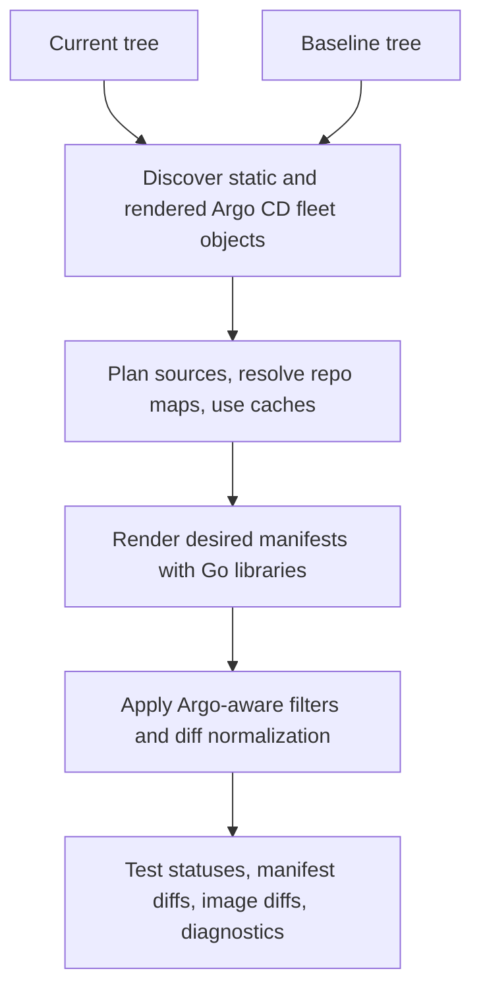

<p align="center">
  
</p>

# drydock

Inspect your Argo CD fleet without getting wet.

[](https://goreportcard.com/report/github.com/sholdee/drydock)
[](https://github.com/sholdee/drydock/actions/workflows/ci.yml)
[](LICENSE)
[](go.mod)

`drydock` is a fast, single static Go binary and embeddable library for
offline Argo CD desired-state analysis. It discovers, renders, tests, diffs,
and diagnoses GitOps Applications without requiring a live Argo CD instance or
Kubernetes cluster.

It is built for operators who want quick, deterministic feedback before a
change reaches the cluster. Pull request diffing is the primary workflow, but
the same native engine also supports render validation, image inventory,
repository diagnostics, cache inspection, and Go API embedding.

Core properties:

- Single static Go binary for local use and CI.
- Native Go renderers and public Go APIs; no repo-server wrapper.
- No default shellouts to `kubectl`, `argocd`, Helm, Kustomize, or config
  management plugin commands.
- Runtime-offline analysis: no running cluster or Argo CD server is required.
- Cache-backed source acquisition for fast repeatable validation.

Runtime-offline does not mean network-disconnected. Declared Git, HTTP Helm,
OCI Helm, and remote Kustomize sources may be fetched into explicit drydock
caches when needed. Use `--offline` to require local files, repo maps, local
charts, or existing cache hits only.

## Install

Install from source with Go:

```bash
go install github.com/sholdee/drydock/cmd/drydock@latest
```

Workflows that install a released binary can use the setup action. It installs
the latest release by default:

```yaml
- uses: sholdee/drydock/setup-action@main
```

Pin a release when the workflow needs exact repeatability:

```yaml
- uses: sholdee/drydock/setup-action@main
  with:
    version: v0.1.0
```

The setup action accepts `latest`, `vX.Y.Z`, or bare `X.Y.Z` and verifies the
selected archive with the release checksum manifest by default.

Release containers are published to GHCR for Linux `amd64` and `arm64`:

```bash
docker run --rm -v "$PWD:/workspace:ro" ghcr.io/sholdee/drydock:latest test apps --path /workspace
```

For repeatable automation, pin `ghcr.io/sholdee/drydock:vX.Y.Z`.

## Quick Start

Run drydock from the root of an Argo CD GitOps repository.

Test every discovered Application without printing rendered manifests:

```bash
drydock test apps --path .
```

Example text output:

```text
PASS renovate
PASS cert-manager
FAIL argocd/broken Application argocd/broken source[0] path="..." ...
```

Compare a pull request checkout against a baseline tree:

```bash
git worktree add ../baseline main
drydock diff apps --path . --path-orig ../baseline
```

You can also compare against committed Git refs without creating a baseline
worktree:

```bash
drydock diff apps --path . --ref-orig main
drydock diff apps --repo . --ref feature --ref-orig main
```

Inspect image changes in a machine-readable form:

```bash
drydock diff images --path . --path-orig ../baseline -o json
```

For CI jobs that have already populated drydock's source caches, require a
cache-only run:

```bash
drydock test apps --path . --offline
drydock diff apps --path . --path-orig ../baseline --offline
```

## Common Workflows

| Goal | Command |
| --- | --- |
| List Applications | `drydock get apps --path .` |
| List rendered image references | `drydock get images --path . -o name` |
| Render all Applications | `drydock build apps --path .` |
| Render one Application | `drydock build app renovate --path .` |
| Test renderability | `drydock test apps --path .` |
| Diff rendered manifests | `drydock diff apps --path . --path-orig ../baseline` |
| Diff one Application | `drydock diff app renovate --path . --path-orig ../baseline` |
| Diff rendered image references | `drydock diff images --path . --path-orig ../baseline -o json` |
| Inspect repository diagnostics | `drydock diag --path .` |
| Inspect redacted settings | `drydock diag --path . --settings -o json` |
| Inspect cache roots | `drydock cache path` |
| List cache entries | `drydock cache list -o json` |

`drydock <command> --help` lists command-specific flags. See
[`docs/usage.md`](docs/usage.md) for the full CLI guide.

## What It Supports

drydock discovers and renders local Argo CD desired state, including:

- Static `Application` resources, supported `ApplicationSet` generators, and
  rendered child `Application`, `ApplicationSet`, `AppProject`, and settings
  objects from app-of-apps/bootstrap sources.
- Optional additional rendered discovery from explicit local Kustomize
  entrypoints with `--discover-kustomize`.
- Single-source and multi-source Applications.
- Directory, Kustomize, local Helm chart, remote Helm chart, and remote
  Kustomize sources.
- Trusted plugin policy entries for native `avp-compat` placeholder redaction
  and native-compatible Kustomize build config management plugins, without
  executing plugin commands.
- Declared Git, HTTP Helm, OCI Helm, and remote Kustomize source acquisition
  into local caches.
- Fast cache-backed repeated runs for local development and CI.
- Repository maps with `--repo-map URL=PATH` for adjacent local checkouts.
- Changed-only desired-vs-desired PR diffs, with strict diagnostics available
  when a safe ownership decision cannot be made.
- Default diff noise filtering for common Helm chart/version labels and
  pod-template checksum annotations, with `--show-ignored-fields` when those
  fields need inspection.
- Argo CD diff customizations such as `ignoreDifferences`,
  `knownTypeFields`, selected compare options, and resource filters.
- Per-Application render test status as `PASS`, `FAIL`, or `SKIPPED`, including
  structured JSON and YAML output.
- Offline validation of configured custom health Lua during render tests.
- Redacted diagnostics for settings, source repositories, AppProjects, and
  cache acquisition events.
- Cache lifecycle commands for Git, chart, and remote Kustomize caches.

See [`docs/compatibility.md`](docs/compatibility.md) for the detailed Argo CD
support matrix. See [`docs/applicationsets.md`](docs/applicationsets.md) for
ApplicationSet details and [`docs/source-acquisition.md`](docs/source-acquisition.md)
for remote source, cache, and auth behavior.

## Offline Runtime Model

drydock is desired-vs-desired analysis. It renders the desired Kubernetes
manifests from a current tree and, for diff commands, a baseline tree. It does
not ask a live cluster or Argo CD server what is currently running. Network
source acquisition, when enabled, is limited to populating explicit drydock
caches for declared repository, chart, and remote Kustomize inputs.

Default commands do not reproduce:

- Kubernetes API defaulting or admission mutation.
- Argo CD server-side diff.
- Live Argo CD Application health aggregation.
- Live-only managed-field ownership.
- Full Argo CD RBAC authorization.
- CLI config management plugin execution or shellout plugin adapters.

Plugin-backed sources fail closed unless an embedding caller injects an
in-process renderer or a trusted `.drydock/plugins.yaml` policy maps that
plugin name to a native drydock engine. Native Kustomize CMP interpretation is
policy-gated; drydock does not treat discovered CMP commands as ambiently
trusted.
Use `--plugin-policy-path`, `--plugin-policy-ref`, and `--plugin-policy-repo`
when CI should load policy from a trusted path or Git ref.

These behaviors are not silently approximated. The no-live-runtime boundary is
an intentional product decision so the default cache-backed workflow stays
deterministic and safe for CI.

Structured outputs keep stdout machine-parseable. Diagnostics and failure
summaries are written to stderr where appropriate, and drydock avoids printing
Secret values, repository credentials, tokens, SSH private keys, passphrases,
registry credentials, or credential-bearing URLs.

## How It Works



The render path imports Argo CD API types and selected reusable helpers, but
drydock owns offline orchestration. See [`docs/design.md`](docs/design.md) for
the architecture and behavior model.

## Go API

Embedding callers can use `github.com/sholdee/drydock/pkg/drydock` to list,
render, and diff Applications without shelling out:

```go
result, err := drydock.Render(ctx, drydock.Config{Path: "."})
```

`drydock.NewClient` accepts public Git, chart, and remote-resource acquirer
interfaces, plus a public config management plugin renderer hook. Embedders can
use those interfaces for tests, offline fixtures, and custom source handling.
When one selected Application fails, the result still includes successful
manifests, diagnostics, and per-Application statuses from the partial build.

## Community

drydock is independently implemented, but its offline GitOps desired-state workflow
was inspired by [home-operations/flate](https://github.com/home-operations/flate)
and the home-operations community.

Join the home-operations Discord at <https://discord.gg/home-operations>.

## Documentation

- [`docs/README.md`](docs/README.md): documentation ownership and routing.
- [`docs/usage.md`](docs/usage.md): operator CLI workflows and high-value
  command examples.
- [`docs/applicationsets.md`](docs/applicationsets.md): ApplicationSet
  generator behavior, fixture schema, and template parameters.
- [`docs/source-acquisition.md`](docs/source-acquisition.md): Git, Helm,
  remote Kustomize, cache, and auth behavior.
- [`docs/compatibility.md`](docs/compatibility.md): supported Argo CD behavior
  and intentional runtime boundaries.
- [`docs/release.md`](docs/release.md): release and Argo CD dependency upgrade
  notes.
- [`docs/reports/live-integration-design-gate.md`](docs/reports/live-integration-design-gate.md):
  the no-live-runtime boundary decision and gate for exceptions.

## License

Apache-2.0. See [`LICENSE`](LICENSE).
