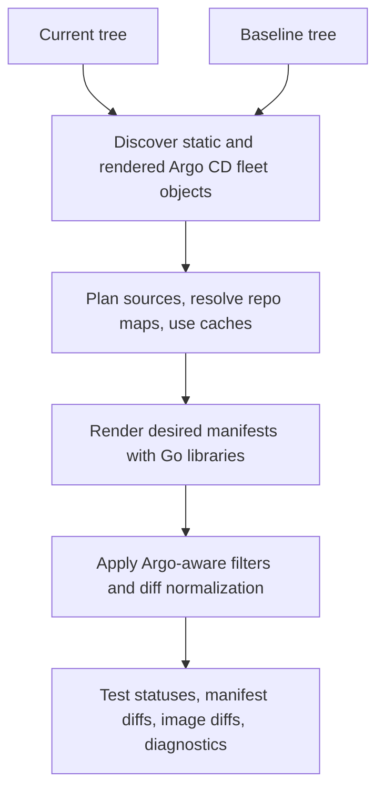

<p align="center">
  
</p>

# drydock

Inspect your Argo CD fleet without getting wet

[](https://goreportcard.com/report/github.com/sholdee/drydock)
[](https://github.com/sholdee/drydock/actions/workflows/ci.yml)
[](LICENSE)
[](go.mod)

`drydock` is a fast, single static Go binary and embeddable library for
runtime-offline Argo CD desired-state analysis. It discovers, renders, tests,
diffs, and diagnoses GitOps Applications without requiring a live Argo CD
instance or Kubernetes cluster.

It is built for operators who want quick, deterministic feedback before a
change reaches the cluster. Pull request diffing is a key workflow, but
the same native engine also supports render validation, image inventory,
repository diagnostics, cache inspection, and Go API embedding.

Default commands use native Go renderers and do not shell out to `kubectl`,
`argocd`, Helm CLI, Kustomize CLI, or repo-server wrappers. Runtime-offline
does not mean network-disconnected: declared Git, HTTP Helm, OCI Helm, and
remote Kustomize sources may still be fetched into explicit drydock caches
unless `--offline` is set.

**Full documentation:** [sholdee.github.io/drydock](https://sholdee.github.io/drydock/).

## Pull Request Review

The PR action posts a markdown summary and links a standalone Full Rendered
Diff View so Argo CD/GitOps reviewers can inspect rendered Kubernetes resources
before merge.

[Open an example Full Rendered Diff View](https://sholdee.github.io/drydock/examples/full-rendered-diff-view.html)

## Install

Install the latest Linux/macOS release with Homebrew:

```bash
brew install sholdee/tap/drydock
```

Homebrew installs shell completions automatically.

For GitOps repository and CI pinning, use `mise` with the GitHub backend:

```toml
[tools]
"github:sholdee/drydock[exe=drydock]" = "vX.Y.Z"
```

<details>
<summary>Install Script</summary>

```bash
curl -fsSL https://raw.githubusercontent.com/sholdee/drydock/main/scripts/install-drydock.sh -o install-drydock.sh
bash install-drydock.sh --yes
```

The script verifies release checksums, verifies Sigstore bundles when
available, installs the `drydock` binary, and attempts shell completion
installation. Pin a release with `--version vX.Y.Z`.

Pipe form:

```bash
curl -fsSL https://raw.githubusercontent.com/sholdee/drydock/main/scripts/install-drydock.sh | bash -s -- --yes
```

Pinned pipe form:

```bash
curl -fsSL https://raw.githubusercontent.com/sholdee/drydock/main/scripts/install-drydock.sh | bash -s -- --version vX.Y.Z --yes
```

Use `--no-completions` when completions should be installed manually.

</details>

<details>
<summary>GitHub Actions</summary>

Workflows that install a released binary can use the setup action:

```yaml
- uses: sholdee/drydock/setup-action@main
  with:
    version: vX.Y.Z
```

For pull request validation, the PR action wraps render tests, manifest diffs,
image diff reports, source caches, artifacts, and sticky PR comments:

```yaml
name: drydock

on:
  pull_request:
    branches: [main]

permissions:
  contents: read
  pull-requests: write

jobs:
  drydock:
    runs-on: ubuntu-latest
    steps:
      - uses: sholdee/drydock/pr-action@main
        with:
          version: vX.Y.Z
```

The setup action accepts `latest`, `vX.Y.Z`, or bare `X.Y.Z` and verifies the
selected archive with the release checksum manifest by default.

See the [GitHub Actions reference](https://sholdee.github.io/drydock/workflows/github-actions/)
for full action inputs, GitHub App token support, cache behavior, comments,
artifacts, and outputs.

</details>

<details>
<summary>Download A Binary</summary>

Download Linux and macOS `amd64` or `arm64` archives from the
[latest release](https://github.com/sholdee/drydock/releases/latest). Verify
the archive with `checksums.txt` before installing the `drydock` binary.

</details>

<details>
<summary>Docker / GHCR</summary>

Release containers are published to GHCR for Linux `amd64` and `arm64`:

```bash
docker run --rm -v "$PWD:/workspace:ro" ghcr.io/sholdee/drydock:latest test apps --path /workspace
```

For repeatable automation, pin `ghcr.io/sholdee/drydock:vX.Y.Z`.

</details>

<details>
<summary>Go Install</summary>

Build from source with Go:

```bash
go install github.com/sholdee/drydock/cmd/drydock@latest
```

</details>

Manual binary installs can generate shell completions with:

```bash
drydock completion zsh
drydock completion bash
drydock completion fish
```

## Quick Start

Run drydock from the root of an Argo CD GitOps repository.

List discovered Applications:

```bash
drydock get apps --path .
```

Test every discovered Application without printing rendered manifests:

```bash
drydock test apps --path .
```

Example text output:

```text
PASS renovate
PASS cert-manager
FAIL argocd/broken Application argocd/broken source[0] path="..." ...
```

Compare a pull request checkout against a baseline tree:

```bash
git worktree add ../baseline main
drydock diff apps --path . --path-orig ../baseline
```

Diff commands use changed-only selection by default. Use
`--changed-only=false` when you want to render and compare every discovered
Application. Use repeatable `--changed-only-include` and
`--changed-only-ignore` globs when CI should ignore known non-GitOps paths
before changed-only ownership is evaluated.

You can also compare against committed Git refs without creating a baseline
worktree:

```bash
drydock diff apps --path . --ref-orig main
drydock diff apps --repo . --ref feature --ref-orig main
```

Inspect image changes in a machine-readable form:

```bash
drydock diff images --path . --path-orig ../baseline -o json
```

For CI jobs that have already populated drydock's source caches, require a
cache-only run:

```bash
drydock test apps --path . --offline
drydock diff apps --path . --path-orig ../baseline --offline
```

## Common Workflows

| Goal | Command |
| --- | --- |
| List Applications | `drydock get apps --path .` |
| List rendered image references | `drydock get images --path . -o name` |
| Render all Applications | `drydock build apps --path .` |
| Render one Application | `drydock build app renovate --path .` |
| Test renderability | `drydock test apps --path .` |
| Diff rendered manifests | `drydock diff apps --path . --path-orig ../baseline` |
| Diff one Application | `drydock diff app renovate --path . --path-orig ../baseline` |
| Diff rendered image references | `drydock diff images --path . --path-orig ../baseline -o json` |
| Inspect repository diagnostics | `drydock diag --path .` |
| Inspect redacted settings | `drydock diag --path . --settings -o json` |
| Inspect cache roots | `drydock cache path` |
| List cache entries | `drydock cache list -o json` |

`drydock <command> --help` lists command-specific flags. See
the [docs reference](https://sholdee.github.io/drydock/reference/) for the
operator guide index.

## What It Supports

drydock covers the common Argo CD GitOps repository shapes operators need to
inspect locally and in CI:

- **Application discovery:** committed Applications, supported ApplicationSets,
  rendered app-of-apps/bootstrap children, explicit Kustomize discovery
  entrypoints, AppProjects, and settings objects.
- **Rendering:** directory, Kustomize, Helm, Jsonnet, single-source and
  multi-source Applications, Kustomize Helm charts, remote Helm charts, and
  remote Kustomize sources.
- **Source acquisition:** declared Git, HTTP Helm, OCI Helm, and remote
  Kustomize inputs through explicit drydock caches, plus `--repo-map` for
  adjacent local checkouts.
- **Diffs and images:** desired-vs-desired manifest and image diffs,
  changed-only selection, default noisy-field filtering, and structured or
  markdown output.
- **Plugins:** native safe Kustomize compatibility, `avp-compat` placeholder
  redaction, `ksops-compat` placeholder rendering for KSOPS generators,
  native policy overrides, static `plugin-policy init` and
  `plugin-policy doctor` onboarding, trusted exec/container policy with
  `--enable-plugins`, and policy bootstrap entrypoints.
- **Diagnostics:** render status, custom health Lua validation, redacted
  settings/repository/AppProject checks, source acquisition diagnostics, and
  cache lifecycle commands.

See the [compatibility overview](https://sholdee.github.io/drydock/compatibility/)
for the support matrix and links to detailed reference docs.

## Offline Runtime Model

drydock performs desired-vs-desired analysis. It renders Kubernetes manifests
from repository inputs, explicit mappings, and drydock caches. Diff commands
compare a current snapshot to a baseline snapshot.

Default commands do not ask a live Kubernetes cluster or Argo CD server what is
currently running. They also do not reproduce runtime behavior such as API
defaulting, admission mutation, server-side diff, live health aggregation,
managed-fields ownership, or full RBAC authorization.

This boundary is intentional: normal workflows stay fast, deterministic, and
safe for local use and CI. Source acquisition may still fetch declared Git,
Helm, OCI, or remote Kustomize inputs unless `--offline` is set.

See [Runtime Offline](https://sholdee.github.io/drydock/concepts/runtime-offline/)
and [Argo CD Render Parity](https://sholdee.github.io/drydock/concepts/argocd-render-parity/)
for the design model and validation strategy.

## How It Works



The render path imports Argo CD API types and selected reusable helpers, but
drydock owns offline orchestration. See
[How It Works](https://sholdee.github.io/drydock/concepts/how-it-works/) and
[Argo CD Render Parity](https://sholdee.github.io/drydock/concepts/argocd-render-parity/)
for the architecture and validation model.

## Go API

Embedding callers can use `github.com/sholdee/drydock/pkg/drydock` to list,
render, and diff Applications without shelling out:

```go
result, err := drydock.Render(ctx, drydock.Config{Path: "."})
```

`drydock.NewClient` accepts public Git, chart, and remote-resource acquirer
interfaces, plus a public config management plugin renderer hook. Embedders can
use those interfaces for tests, offline fixtures, and custom source handling.
When one selected Application fails, the result still includes successful
manifests, diagnostics, and per-Application statuses from the partial build.

## Community

drydock is inspired by [Flate](https://github.com/home-operations/flate), a
Flux resource inflator, and the home-operations community.

Join the home-operations Discord at <https://discord.gg/home-operations>.

## Documentation

- [Documentation site](https://sholdee.github.io/drydock/): curated operator
  docs and full reference pages.
- [Getting started](https://sholdee.github.io/drydock/getting-started/):
  first local discovery, render test, and comparison commands.
- [GitHub Actions](https://sholdee.github.io/drydock/workflows/github-actions/):
  setup action, PR action, comments, artifacts, and caches.
- [Local diffs](https://sholdee.github.io/drydock/workflows/local-diffs/):
  terminal manifest and image diff workflows.
- [Compatibility](https://sholdee.github.io/drydock/compatibility/): supported
  Argo CD behavior and intentional runtime boundaries.
- [Runtime Offline](https://sholdee.github.io/drydock/concepts/runtime-offline/):
  what drydock does without live Argo CD or Kubernetes.
- [Argo CD Render Parity](https://sholdee.github.io/drydock/concepts/argocd-render-parity/):
  how covered render semantics are validated against real Argo CD.
- [Plugin policy](https://sholdee.github.io/drydock/plugin-policy/):
  onboarding commands, trusted policy engines, schema, CMP compatibility,
  bootstrap discovery, and command security.
- [Source acquisition](https://sholdee.github.io/drydock/concepts/source-acquisition/):
  Git, Helm, remote Kustomize, cache, and auth behavior.
- [Reference](https://sholdee.github.io/drydock/reference/): operator guide
  index.

## License

Apache-2.0. See [`LICENSE`](LICENSE).
