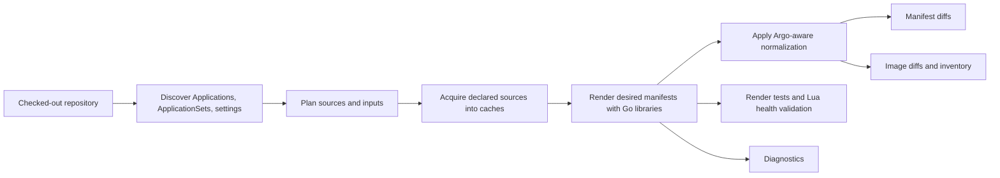

# drydock Design

`drydock` is an independent Go CLI and embeddable library for Argo CD GitOps
repository analysis. It discovers Argo CD Applications, renders desired
manifests, validates renderability, inspects images and diagnostics, and
compares current and baseline desired state for pull request diffs.

The core design target is offline-runtime analysis: default workflows require
no running Kubernetes cluster, Argo CD instance, `kubectl`, `argocd`, Helm CLI,
Kustomize CLI, repo-server, or external render service. Declared Git, HTTP
Helm, OCI Helm, and remote Kustomize sources may be fetched into explicit
drydock caches unless `--offline` is set.

## Runtime Boundary

drydock is not a live-cluster diff. It does not query Kubernetes or Argo CD,
run Argo CD controllers, or silently approximate live-only behavior. These are
intentional product boundaries:

- Kubernetes API defaulting and admission mutation.
- Argo CD server-side diff.
- Live server-side apply field ownership prediction.
- Live Argo CD Application health aggregation.
- Full Argo CD RBAC authorization.
- CLI config management plugin execution and repo-server sidecar discovery.
- Live provider APIs for ApplicationSet generators.

Future live-runtime work must remain explicitly opt-in and pass the design gate
in `docs/reports/live-integration-design-gate.md`.

## Architecture

The production path is a native local engine using Argo CD API types and
selected reusable helpers where they are decoupled from live runtime services.
drydock owns discovery, source planning, cache use, rendering orchestration,
diagnostics, and output shaping.

Primary packages:

- `cmd/drydock`: Cobra CLI and exit-code handling.
- `pkg/drydock`: public embedding API.
- `internal/config`: Argo CD settings model and provenance.
- `internal/discovery`: repository scanning for Applications, ApplicationSets,
  settings, projects, repository metadata, and cluster metadata.
- `internal/appset`: deterministic local ApplicationSet expansion.
- `internal/source`, `internal/chart`, `internal/remote`,
  `internal/acquisition`: Git, Helm, remote Kustomize, cache, and credential
  plumbing.
- `internal/render`: Helm, Kustomize, directory, and plugin renderer
  interfaces.
- `internal/app`: Application normalization, source planning, `$ref`
  resolution, repeated-resource handling, and orchestration.
- `internal/change`: changed-file detection and Application input indexing.
- `internal/diff` and `internal/manifest`: manifest normalization, resource
  diffs, and image extraction.
- `internal/diagnostic`: stable diagnostics, provenance, and strict-mode
  escalation.

The repo-server wrapper approach is not the default architecture. Argo CD
repo-server internals can be compatibility references or test oracles, but the
runtime path must stay a self-contained Go binary.

## Settings Model

Runtime settings are normalized into `ArgoSettings`. Every discovered value
carries provenance so diagnostics can explain where behavior came from.

Provider precedence:

1. Explicit CLI flags such as `--argocd-cm`, `--argocd-values`,
   `--repo-secret`, and `--kustomize-build-option`.
2. Rendered Argo CD ConfigMap candidates, especially `argocd-cm`.
3. Argo CD Helm values candidates, including `configs.cm`.
4. Repository Secrets labeled
   `argocd.argoproj.io/secret-type: repository`, using only non-sensitive
   metadata.
5. Built-in Argo CD defaults.

Rendering and diff-affecting settings are enforced. Resource action Lua is
parsed as metadata only. Custom health Lua is validated offline during render
tests against rendered desired manifests; it is not live Argo CD health
aggregation.

## Discovery And ApplicationSets

Discovery scans the selected repository tree for direct `Application` CRs,
supported generated `ApplicationSet` Applications, Argo CD settings,
AppProjects, repository metadata, and cluster Secret metadata. Generated and
direct Applications share the same downstream planning, rendering, test, and
diff path.

ApplicationSet support is deterministic and local. Git, list, matrix, merge,
and fixture-backed provider generators are documented in
`docs/applicationsets.md`.

Unsupported generators or unsupported fields produce diagnostics. Non-strict
commands keep supported Applications where possible; `--strict` promotes those
diagnostics to errors.

## Source Planning And Acquisition

Applications follow Argo CD source precedence:

- `spec.sources` wins when non-empty.
- `spec.source` is used otherwise.

Each source renders independently in source array order. Ref-only sources
render no manifests. `$ref/...` Helm value files resolve from the referenced
source root, not from the referenced source `path`. If multiple sources emit
the same resource identity inside one Application, the later source wins and a
repeated-resource diagnostic is emitted.

Repository resolution and cache behavior are documented in
`docs/source-acquisition.md`. Important invariants:

- `--repo-map URL=PATH` wins over local source fallback and network fetching.
- PR diff roots are authoritative for mapped repositories.
- Unmapped external Git repositories fetch into the Git cache by default and
  require cache hits or repo maps under `--offline`.
- Credential use is explicit, non-interactive, and redacted.
- Caches must stay outside selected repository trees and symlink-resolved
  equivalents.

## Rendering

All renderers implement an internal renderer interface and return manifests,
diagnostics, and errors without writing generated output into the source tree.

Supported render paths:

- Directory manifests.
- Kustomize sources using Go libraries and supported Argo CD build options.
- Local Helm charts.
- Kustomize `helmCharts` through the shared Helm library path.
- Remote Helm chart sources from HTTP(S) and OCI repositories.
- Remote Kustomize HTTP(S) files and Git refs.
- Trusted plugin policy entries that map plugin names to native drydock
  engines such as `avp-compat` and `native-kustomize`. The
  `native-kustomize` engine may use native-compatible Kustomize build CMP
  definitions discovered from Argo CD Helm values or rendered
  `argocd-cmp-cm` ConfigMaps, but only when the trusted policy explicitly
  permits that plugin name.
- Deterministic in-process plugin renderers supplied by embedding callers.

The default CLI and default Go client fail closed for other config management
plugin sources unless an embedding caller injects a plugin renderer.

## Diff Semantics

Manifest diffs are desired-vs-desired. They answer: "What rendered desired
manifests changed between the baseline tree and current tree?"

Diff behavior:

- Render both sides with the same planning and settings model.
- Apply Argo CD `ignoreDifferences`, known type fields, resource exclusions,
  inclusions, and supported compare options where possible without live state.
- Hide common Helm chart/version label noise and pod-template `checksum/*`
  annotations by default.
- Preserve the ability to show drydock-default ignored fields with
  `--show-ignored-fields`.
- Treat server-side diff/apply settings as diagnostics, not executable live
  behavior.
- Resolve `--ref` and `--ref-orig` through temporary local snapshots without
  shelling out to `git` or mutating the operator checkout.

Changed-only mode is on by default for multi-Application PR diffs. It indexes
Application manifest files, source paths, `$ref` value files, and supported
`argocd.argoproj.io/manifest-generate-paths` inputs. If every changed path can
be mapped, only affected Applications render. If any path is unowned,
non-strict mode warns and renders all Applications; `--strict-changed-only`
fails instead.

Argo CD permits overlapping Applications, so drydock keeps every affected
Application instead of collapsing ownership to one most-specific owner.

## Output And Diagnostics

Structured outputs keep stdout machine-parseable. Diagnostics and failure
summaries go to stderr unless status text is the primary output.

Exit codes:

- `0`: success and no diff for diff-style commands.
- `1`: success with a diff for diff-style commands.
- `2`: tool, configuration, discovery, or render error.

Diagnostics are provenance-based and redact secrets. Repository Secrets only
contribute non-sensitive metadata. Required diagnostic surfaces include
settings provenance, conflicting settings candidates, unsupported
ApplicationSet behavior, unsupported source types, offline runtime limitations,
repeated resources, unowned changed files, strict-mode escalations, source
repository checks, destination checks, and cache acquisition events.

## Public API

`pkg/drydock` exposes Application listing, rendering, manifest diffs, image
diffs, source acquisition hooks, plugin renderer hooks, stable diagnostics, and
partial build results. Public APIs must not expose `internal/...` types.

Embedding callers can inject deterministic Git, chart, remote-resource, and
plugin renderers for tests or controlled environments. The package-level API
uses the same default network, cache, and runtime-boundary behavior as the CLI.

## Versioning

The module pins Argo CD dependencies deliberately. Argo CD upgrades are explicit
PRs with compatibility test updates and `docs/compatibility.md` updates.

`drydock version` prints the drydock version, embedded Argo CD dependency
versions, and Go version. Release binaries receive their version from release
build metadata.
