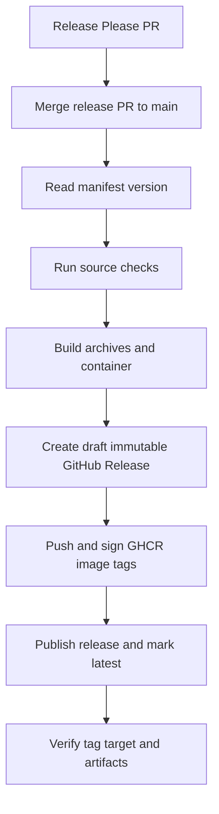

# Release And Upgrade Notes

`drydock` is a single static Go binary and embeddable Go module. Release
artifacts should preserve the runtime-offline core contract: render and diff
from checked-out files plus explicit caches, without requiring a cluster,
Argo CD server, `kubectl`, `argocd`, Helm/Kustomize command-line tools, or
external rendering processes.

## Argo CD Dependency Upgrades

When upgrading the Argo CD module:

1. Review API changes for `Application`, `ApplicationSet`, `AppProject`,
   source rendering options, and diff customization semantics.
2. Run `mise run test-race`, `mise run vet`, and `mise run lint`.
3. Run focused compatibility tests for ApplicationSet generators, global
   settings parsing, AppProject validation, and source acquisition.
4. Update `docs/compatibility.md` in the same change.

## Cache Compatibility

Remote Git, Helm chart, and remote Kustomize cache keys must continue to avoid
credential material. If cache key formats change, document whether existing
cache entries are ignored, migrated, or pruned. Do not write cache data under a
GitOps repository tree.

Cache event reporting is a compatibility surface for source type, action,
redacted target, revision, cache hit, offline, refresh, and error fields.
Events must not expose credentials, query tokens, SSH private keys,
passphrases, or raw repository URLs with embedded secrets.

## GitHub Actions

The repository includes an optional composite install action at `setup-action`.
It is release metadata only; it does not change the default static binary,
`--offline` behavior, or runtime-offline render/diff contract.

The action accepts `latest`, `vX.Y.Z`, or bare `X.Y.Z` inputs. `latest` is
resolved from the latest GitHub Release before download. Bare versions are
normalized to `vX.Y.Z` so release tags remain Go-style SemVer. The action builds
versioned GitHub Release URLs for the current runner OS/architecture and never
uses `curl | sh`. Supported runner pairs are Linux and macOS on `amd64` and
`arm64`.

Expected release artifact names are:

- `drydock_linux-amd64.tar.gz`
- `drydock_linux-arm64.tar.gz`
- `drydock_darwin-amd64.tar.gz`
- `drydock_darwin-arm64.tar.gz`

If the release publishes `checksums.txt`, the action verifies the selected
artifact with `sha256sum --check` when available, or `shasum -a 256 -c` on
runners where `shasum` is the available SHA-256 verifier. Only a 404 for
`checksums.txt` can be treated as an intentionally unpublished checksum
artifact, and only when `allow-unverified: true` is set. By default, missing
checksums and checksum download failures fail the action.

By default, the setup action may restore and save the verified release archive
through GitHub Actions cache. `latest` is resolved to a concrete release tag
before cache lookup, and cache keys include the release checksum. Cache restore
and save are skipped when `allow-unverified: true` is set.

Example:

```yaml
- uses: sholdee/drydock/setup-action@main
```

Pinned example:

```yaml
- uses: sholdee/drydock/setup-action@main
  with:
    version: v0.1.9
    install-dir: /usr/local/bin
```

Public required CI should continue to build and test from source unless a
workflow intentionally opts into installing a released binary.

The repository also includes `pr-action`, a higher-level pull request wrapper
around the released binary. It owns workflow ergonomics for render tests,
manifest diffs, image diff comments, artifacts, and source cache restore/save.
It must preserve the same token boundary as the CLI: GitHub tokens may be used
for checkout, release downloads, baseline fetch, and comments, but they must
not be exported to `drydock` subprocesses or stored in drydock caches or
artifacts.

## Release Automation

Release tags use true SemVer with a leading `v`, such as `v0.1.0`. Release PRs
are managed by release-please using conventional commits and
`release-please-config.json`.

Release automation is split by ownership:

- The `Release Please` workflow manages changelog/version release PRs only.
  It must not create GitHub Releases or release tags.
- The `Release` workflow publishes an unreleased version from
  `.release-please-manifest.json` after the release PR is merged.



This preserves the normal operator workflow of marking the release PR ready,
waiting for CI, and merging it. The publishing workflow then builds, signs, and
checks all release artifacts before it creates a public GitHub Release.

If the manifest version already has a matching remote tag and published GitHub
Release, the publish workflow exits without creating another release. If the
tag is missing, the workflow creates only a local tag for GoReleaser version
calculation, builds release artifacts, validates the container image build,
and creates a draft GitHub Release targeted at the release commit with all
binary assets attached. After the draft exists, it pushes and signs the
container image tags, updates the release notes with the image digest, and
publishes the draft. The workflow does not push the release tag directly before
the draft exists; it lets GitHub manage the tag from the draft release target
and verifies that the published tag points to the release commit. This order
keeps the release process compatible with GitHub immutable releases while still
allowing retries if a draft release or stale automation tag was left behind by
a failed run.

GoReleaser builds static Linux and macOS archives for `amd64` and `arm64`:

- `drydock_linux-amd64.tar.gz`
- `drydock_linux-arm64.tar.gz`
- `drydock_darwin-amd64.tar.gz`
- `drydock_darwin-arm64.tar.gz`

Each release must include `checksums.txt`. The setup action refuses unverified
installs unless `allow-unverified: true` is explicitly set. Releases also attach
archive SBOMs and Sigstore bundle files generated by GoReleaser with Cosign.

## Container Image

The release workflow publishes a static, distroless, nonroot container image to
GHCR:

- `ghcr.io/sholdee/drydock:vX.Y.Z`
- `ghcr.io/sholdee/drydock:latest`

The workflow validates the image build before release publication, then pushes
and signs the versioned image and `latest` after the draft release exists and
before the release is made public. The version tag is immutable release
metadata. `latest` intentionally moves to the most recent published release.
Do not publish floating `v0` or `v0.1` image tags until the project has an
explicit compatibility policy for them.

The Dockerfile must preserve drydock's default runtime-offline contract: it
contains the drydock binary only, runs as nonroot, and does not add `kubectl`,
`argocd`, Helm, Kustomize, plugin runtimes, shells, or live-cluster tooling.
Container defaults set cache locations under `/tmp` so one-shot Docker runs can
fetch declared sources when network access is available. Use `--offline` inside
the container when cache-only behavior is required.

Container usage example:

```bash
docker run --rm -v "$PWD:/workspace:ro" ghcr.io/sholdee/drydock:latest test apps --path /workspace
```

Helm charts and live-cluster release smoke tests remain outside the release
shape because drydock is intentionally independent of live Argo CD and
Kubernetes runtime.
