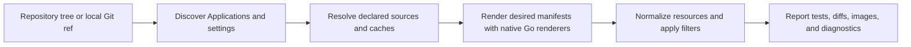

drydock turns repository inputs into reviewable Argo CD desired-state reports.
It uses the same pipeline for `get`, `test`, `diff`, image inspection, and
diagnostics, with two repository snapshots for diff commands.

## Discovery

drydock scans repository YAML for Argo CD `Application`, supported
`ApplicationSet`, `AppProject`, and settings objects. It can also render
explicit Kustomize discovery entrypoints when bootstrap inputs are not committed
as inflated Argo CD objects.

Supported ApplicationSet generators expand offline from local files, lists,
matrix and merge combinations, or explicit provider fixtures. Unsupported
generators produce diagnostics instead of guessing.

## Source Resolution

Application sources resolve from repo maps, local paths, declared Git sources,
Helm chart sources, remote Kustomize resources, and drydock caches. Default
runs may fetch declared Git, HTTP Helm, OCI Helm, and remote Kustomize inputs
into explicit caches. `--offline` makes those source lookups cache-only.

## Rendering

drydock renders desired manifests with native Go renderers for directory,
Jsonnet, Kustomize, Helm, Kustomize `helmCharts`, remote Kustomize resources,
and supported chart-only Helm sources. Config management plugin execution is
disabled by default; trusted plugin policy and explicit opt-in are required for
exec plugins.

## Reporting

`test` reports whether selected Applications render. `diff apps` compares
desired manifests between two snapshots. `diff images` projects rendered image
references from those manifests. `diag` reports repository, source, settings,
and compatibility issues without printing manifest bodies.

Diagnostics and structured outputs are kept separate so JSON, YAML, and name
outputs remain machine-parseable. Markdown diff output is intended for pull
request comments and includes the review summary with expandable rendered
manifest changes.
